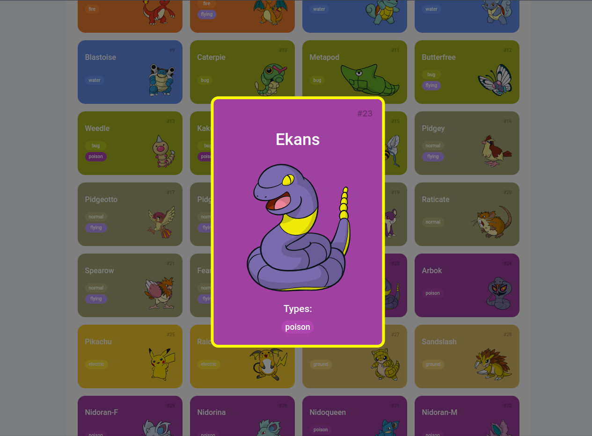

# Trilha JS Developer - Pokedex

Resolução Gabriel Moises Alves.

## Features adicionadas

- Mostra um modal ao clicar em um pokemon.
- Modal com um card de pokemon com seus detalhes.
- Estilização do modal e adicional em pokemons.

> Preview de um modal:

